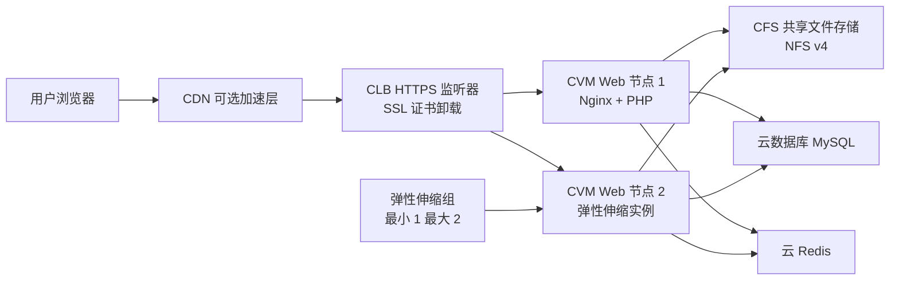

# WordPress 应用层高可用部署（腾讯云 CLB）

> 个人实践项目：在腾讯云上部署 WordPress，结合 CFS、CLB、弹性伸缩、CDN 与云 Redis，完成应用层横向扩展、HTTPS 访问和基础性能测试。

[](https://cloud.tencent.com/)
[](https://wordpress.org/)
[](https://nginx.org/)
[](https://cloud.tencent.com/product/crs)
[](https://cloud.tencent.com/product/cdb)

> 说明：本项目实现的是**应用层高可用**。数据库高可用、跨可用区容灾、WAF 防护和完整的监控告警体系属于后续优化方向。

## 目录

- [项目说明](#项目说明)
- [架构](#架构)
- [资源与组件](#资源与组件)
- [部署流程](#部署流程)
- [关键配置示例](#关键配置示例)
- [基础压测](#基础压测)
- [排障记录](#排障记录)
- [已知限制与后续优化](#已知限制与后续优化)
- [安全说明](#安全说明)
- [许可协议](#许可协议)

## 项目说明

本项目聚焦 WordPress 在云上部署时的基础可用性、访问安全与性能优化。Web 层通过负载均衡和弹性伸缩实现横向扩展；WordPress 程序文件存放在 CFS 共享文件存储中，确保新增 Web 实例能够访问相同的站点文件。

> 本仓库仅包含文档与脱敏示例，**不包含**任何真实配置、密钥、证书或完整 `wp-config.php`。

## 架构



## 资源与组件

| 组件 | 用途 |
| --- | --- |
| CVM | 运行 Nginx、PHP-FPM 与 WordPress Web 服务 |
| VPC / 子网 / 安全组 | 规划私网通信与最小权限访问规则 |
| CFS | 通过 NFS v4 挂载并共享 WordPress 文件 |
| 云数据库 MySQL | 存储 WordPress 数据 |
| 云 Redis | 用于 WordPress 对象缓存 |
| CLB | 七层域名转发、健康检查与 HTTPS 监听 |
| 弹性伸缩 AS | 基于自定义镜像创建 Web 实例，最小 1、最大 2 台 |
| CDN | 缓存加速与缓存刷新/预热验证 |

## 部署流程

1. 创建 VPC、子网、安全组、CVM、云数据库 MySQL、云 Redis 和 CFS。
2. 为 MySQL 创建 WordPress 数据库与最小权限数据库用户；数据库仅允许指定 Web 节点通过私网访问。
3. 在 Web 节点安装 Nginx、PHP-FPM、PHP MySQL 驱动、Redis 扩展与 NFS 客户端。
4. 将 CFS 以 NFS v4 挂载到 `/mnt/cfs1`，在共享目录中准备 WordPress 文件。
5. 配置 `wp-config.php` 中的数据库与 Redis 连接信息。实际配置文件不得提交到仓库。
6. 配置 Nginx 虚拟主机，启动并设置 Nginx、PHP-FPM 开机自启。
7. 创建 CLB 七层监听器、域名转发规则和健康检查；HTTPS 监听器配置证书，并将后端转发至 Web 节点 HTTP 端口。
8. 从完成基础配置的 Web 节点创建自定义镜像，创建启动配置与伸缩组，设置最小实例数 1、最大实例数 2，并关联 CLB。
9. 配置 CDN 域名加速、缓存规则、HTTPS 服务及刷新/预热；使用响应头验证缓存命中与回源。
10. 接入 Redis 对象缓存并进行基础压测。

## 关键配置示例

### Nginx 站点配置

以下仅为脱敏示例。域名、证书路径和站点根目录应按实际环境替换。

```nginx
server {
    listen 80;
    server_name example.com;
    root /mnt/cfs1/wordpress;
    index index.php index.html;

    location / {
        try_files $uri $uri/ /index.php?$args;
    }

    location ~ \.php$ {
        include fastcgi_params;
        fastcgi_param SCRIPT_FILENAME $document_root$fastcgi_script_name;
        fastcgi_pass 127.0.0.1:9000;
    }
}
```

### 服务检查

```bash
systemctl status nginx php-fpm
ss -lntp
curl -I http://example.com
curl -I https://example.com
```

### CDN 验证

```bash
curl -I https://example.com/
```

检查响应头中的缓存状态、CDN 标识和回源信息。生产环境不应对 `wp-admin`、登录页、带 Cookie 的个性化页面等动态内容设置不恰当的公共缓存规则。

## 基础压测

使用 ApacheBench 对 WordPress 首页进行基础 HTTP 压测：

```bash
ab -n 1000 -c 20 https://example.com/
```

在相同压测机、URL、并发数和请求总数下，接入 Redis 对象缓存后：

| 指标 | 优化前 | 优化后 |
| --- | ---: | ---: |
| 平均单请求响应时间 | 215 ms | 178 ms |
| 响应时间变化 | - | 约 17% 改善 |
| Redis 命中率 | - | 91% |

> 上述结果为个人练习环境下的基础测试数据，并非生产容量评估结论。

## 排障记录

### WordPress 数据库连接超时

**现象：** 页面访问出现数据库连接异常或超时。

**排查：** 检查 `wp-config.php`、数据库私网地址及端口、安全组入站规则和数据库服务状态。

**根因与处理：** 数据库使用自定义端口后，应用侧 `DB_HOST` 未同步端口；修正连接配置，并限制仅允许指定 CVM 私网 IP 访问数据库端口。

### Web 节点未通过 CLB 健康检查

**排查路径：** 检查 Nginx/PHP-FPM 服务状态、监听端口、后端安全组规则、CLB 健康检查协议/端口/路径和本机 `curl` 返回结果。

**验证：** 在 CLB 控制台确认后端实例状态为“健康”，并通过域名访问验证转发正常。

### Redis 连接异常

**排查路径：** 检查云 Redis 的私网地址、端口、认证信息、访问白名单或安全组规则，以及 WordPress 缓存插件和 `wp-config.php` 的连接配置。

**验证：** 使用 Redis CLI 和 WordPress 页面访问结果验证连通性与缓存生效情况。

## 已知限制与后续优化

- 当前架构仅覆盖应用层横向扩展，数据库仍需通过高可用实例、主从复制或备份恢复方案补足容灾能力。
- 弹性伸缩实例应确保 Nginx、PHP-FPM 等服务可自动启动；可通过镜像固化、启动脚本或配置管理工具提高一致性。
- 后续可接入云监控、告警、日志集中采集、WAF、备份恢复演练和更完整的压测方案。
- 对于更复杂的压测场景，可使用 k6、wrk 或 JMeter 补充登录、Cookie、动态接口和高并发测试。

## 安全说明

- 不提交证书私钥、云账号凭据、真实域名/IP、数据库密码、Redis 密码或完整 `wp-config.php`。
- `.env`、证书目录、密钥文件和真实配置文件应加入 `.gitignore`。
- 不使用 `chmod -R 777` 作为生产权限方案；应为 Web 服务账户授予必要目录的最小读写权限。

## 许可协议

本项目暂未指定开源许可证。
